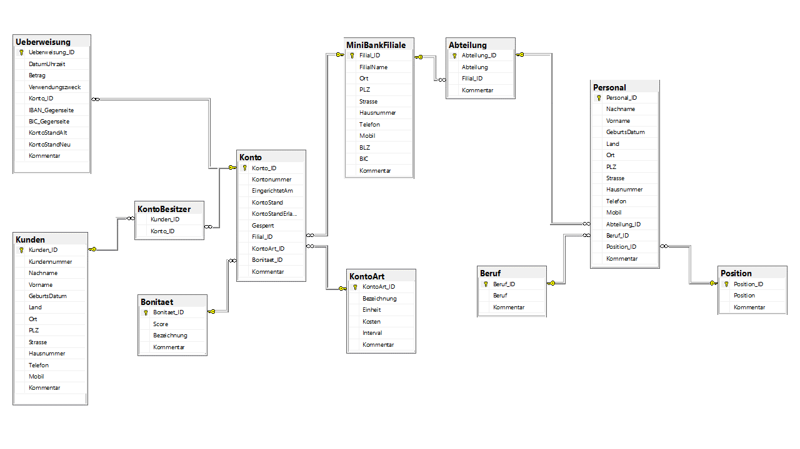

# Abschlussprojekt des 4 wöchigen Kurses - Relationale Datenbanken mit SQL

## Businesslogik:

* In der MiniBank werden Kundenkonten verwaltet und Überweisungen getätigt
* Kunden können Überweisungen tätigen und Geld erhalten, vorausgesetzt das Kundenkonto ist nicht gesperrt.
* Wenn ein Kunde überweist wird auch geprüft ob dabei sein Kontolimit nicht überschritten wird
* Es gibt 6 verschiedene Kontoarten und 6 Bonitätsstufen
* Kunden überweisen Gebühren an die MiniBank oder erhalten Zinsen in verschiedenen Intervallen.
* In der Prozedur `[sp_Ueberweisung]` werden die Angaben auf einer Überweisung auf Plausibilität geprüft
* Der Script `„005‐02‐EG‐CREATE‐Cursor_Gebuehren_Zinsen.sql“` welches sich noch in der Entwicklungsphase befindet, belastet alle nicht gesperrte Konten mit Gebühren oder Zinsen
  * Konten werden in einem Intervall (Tabelle [KontArt]) mit verschiedenen KostenArten und je nach Bonität belastet.

## Datenbankdiagramm

## Varianten der Überweisung für die Prozedur [sp_Ueberweisung]

<table>
<tr><th colspan="2">Varianten der Überweisung für die Prozedur [sp_Ueberweisung]</th></tr>
<tr><td>
   <table>
       <thead>
           <tr>
               <th>Varianten</th>
               <th>Konto_ID</th>
               <th>Geldfluss</th>
               <th>IBAN</th>           
           </tr>        
       </thead>
       <tbody>
           <tr>
               <td>1</td>
               <td>Kunde‐A</td>
               <td>&#10230;</td>
               <td>Fremde‐Bank</td>
           </tr>
           <tr>
               <td>2</td>
               <td>Kunde‐A</td>
               <td>&#10229;</td>
               <td>Fremde‐Bank</td>
           </tr>
           <tr>
               <td rowspan=2>3</td>
               <td>Kunde‐A</td>
               <td>&#10230;</td>
               <td>Kunde‐B</td>
           </tr>
           <tr>
               <td>Kunde‐B</td>
               <td>&#10229;</td>
               <td>Kunde‐A</td>
           </tr>    
       </tbody>
   </table>
</td><td>
   <table>
       <thead>
           <tr>
               <th>Beispiel</th>
           </tr>
       </thead>    
       <tbody align="right">
           <tr>
               <td>-100,00 €</td>
           </tr>
           <tr>
               <td>75,00 € </td>
           </tr>
           <tr>
               <td>-250,00 €</td>
           </tr>
           <tr>
               <td> 250,00 € </td>
           </tr>    
       </tbody>
   </table>
</td></tr> </table>
